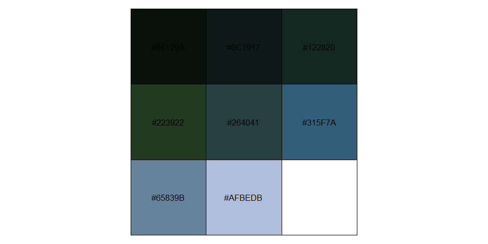
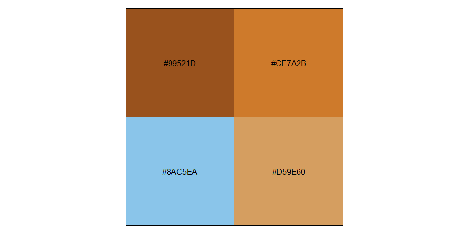
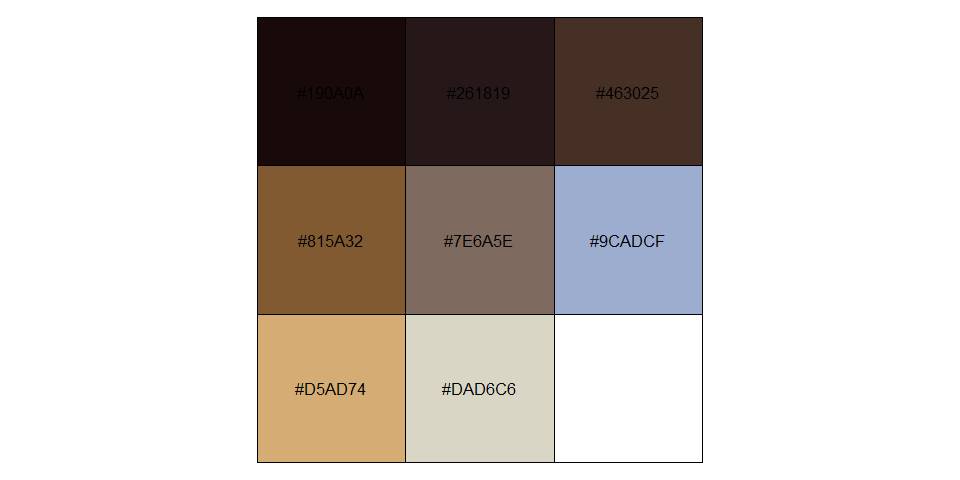
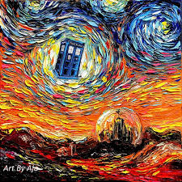
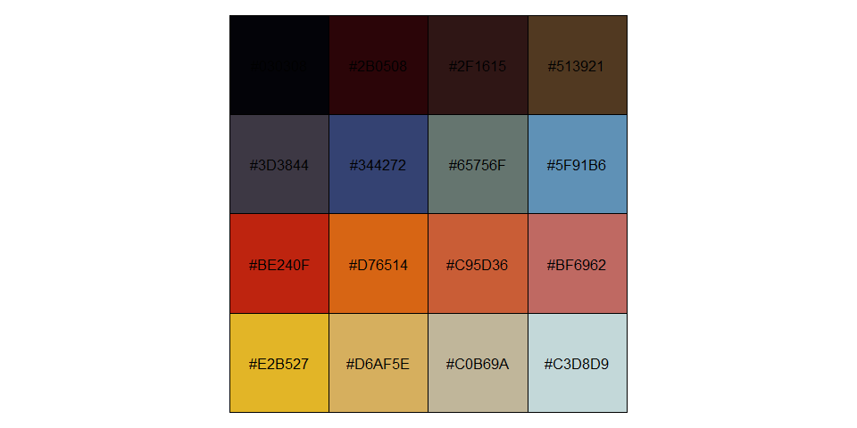

Color quantization
================
Márcio Martins
11 de Maio de 2018

This is a small personal project inspired by some blog posts (see below). The main goal is to create a function that takes a raster image as input and returns a color palette that best represents that image.

While reading the posts about how the author of the PaletteR package tries to not only maximize how well a palette represents an image, but also make sure that colors are as distinguishable as possible, I decided to read up on how color quantization is normally performed. One of the most widely mentioned (and simpler) algorithms was called median cut. It seemed relatively simple and I decided to try and implement in in R.

Blog posts that lead to this project: <http://www.milanor.net/blog/build-color-palette-from-image-with-paletter/> <https://datascienceplus.com/how-to-use-paletter-to-automagically-build-palettes-from-pictures/>

Median cut algorithm: <https://en.wikipedia.org/wiki/Median_cut>

This implementation is of the most basic version of the algorithm, meaning color palettes will always have a number of colors that is base 2 *(TODO: change the cut function to only apply to the bucket with highest range of colors to allow the creation of palettes with any number of colors)*.

Below are some of the example color palettes created using this method, and corresponding original images.

Results
-------

### Forest


``` r
image_a <- quantize_colors("./test_images/a.jpg")
show_col(image_a)
```



### Desert


``` r
image_b <- quantize_colors("./test_images/b.jpg", ncolor = 4)
show_col(image_b)
```



### Canigiani Holy Family


``` r
image_c <- quantize_colors("./test_images/c.jpg")
show_col(image_c)
```



### Doctor Who - Van Gogh styled



``` r
image_d <- quantize_colors("./test_images/d.jpg", ncolor = 16)
show_col(image_d)
```


